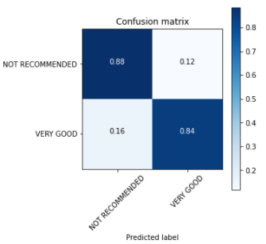

 **Determining best features in wines**

**Analyzing expert wine reviews using NLP methods**

**Author:** Gabriel J. Araujo

The contents of this repository detail an analysis of the Flatiron Data Science module 4 project. This analysis is detailed in hopes of making the work accessible and replicable.

 **Business Problem** 

The earliest evidence of wine is from 8,000 years ago in Georgia and today it is one of the most consumed alcoholic beverages in the world. According to Fortune Business Insights, in 2019, the global wine market was valued at USD 364.25 billion and is projected to reach USD 444.93 billion by 2027. 

Common reasons why people consume wine include:
- It can be used before a meal to improve one's appetite.
- Drinking wine during a meal can enhance and complement the flavor of food.
- It is served during social and religious gatherings.
- Health benefits, such as heart disease and diabetes prevention. 

No matter the reason for consumption, people enjoy to drink the best wine they can afford. A good way to assure that a great tasting wine is being purchased is to look at it's score. A wine score is the simplest way for a wine critic to communicate their opinion about the quality of a wine. The 100-point is the most common method for scoring wines and it is used by several wine critics from all around the world.

The 100-point scale works as follows:

This project will focus on creating a model that can determine if the quality of a wine is good or bad based on words used in its review and use the findings from that same model to assist wine makers by giving them pointers into what flavors, textures, colors they should focus on when making their wine.

**Goals**

The goals of this project are:
- Create a model that can efficiently distinguish and identify very good quality wines from low quality wines.
- Determine key features in high quality wines.
- Determine the best method to preprocess ,analyze, and model wine reviews.

**Data**

The dataset being analyzed in this project is called "Wine Reviews" and was taken from https://www.kaggle.com/zynicide/wine-reviews

This dataset consists of 150,930 observations and 10 unique features.

**Method**

 **Analysis Framework** 

This project will use the OSEMN framework (outlined in brief below)

**Obtain**
 
- Obtain Wine Reviews dataset from Kaggle.com.

**Scrub**
 
- Remove unwanted features (Country, Designation, Price, etc...).
- Fill/remove null values.
- Remove stop words from corpus.

**Explore**
 
- Create Word Cloud.
- Lemmatize/Stem Word Tokens

**Model**
- Random Forests Classifier.
- Deep NLP

**Interpret**
- Results.
-  Recommendations and Future Work.

**Scrub**

Preparing text data requires more processing than normal data.
1. The following things must be removed:
    - Punctuation
    - Capitalization
    - Numbers
    
    
2. In most analyses, text needs to be **tokenzied** into a list of words and not remain in a sentence format.

3. It is always recommended to remove commonly used words that contain little information, called **Stop Words** (words like: the,was,he,she, it,etc...) from the machine learning algorithms. This is done in order to reduce the dimensionality of each corpus down to only the words that contain important information.

4. In most cases, each word token is reduced down to its root word. For cases such as "run", "runs", "running" and "ran", they are more similar than different, we may want our algorithm to treat these as the same word, "run".
  Simplifying words down to the basic core word (or word *stem*) is referred to as **"Stemming"**.   A more advanced form of this also understands things like words that are just in a **different tense** such as  i.e.  **"ran", "run", "running"**. This process is called  **"lemmatization**, where the words are reduced to their simplest form, called "**lemmas**"  

    
|   Word   |  Stem | Lemma |
|:--------:|:-----:|:-----:|
|  Studies | Studi | Study |
| Studying | Study | Study |

5. Finally, we have to convert our text data into numeric form for our machine learning models to analyze, a process called **Vectorization**.  

| Document | dry | fruit | ... | intense |
|:--------:|:---:|:-----:|-----|---------|
|     1    |  0  |   3   | ... |    1    |
|     2    |  1  |   2   | ... |    0    |   

>   - **There are several different ways we can vectorize our text:**
      - Count vectorization
      - Term Frequency-Inverse Document Frequency (TF-IDF)
      - Word Embeddings (Deep NLP)
    
    
**Information taken from Flatiron School Natural Language Processing Section and from instructor James Irving.**

  

In order to make this classification problem simpler, the points will be divided into categories. If the points were broken down into the categories in the 100-points system, this project would be a 6-class classification problem and the model would have a difficult time predicting the classes.

A wine expert was consulted and stated that wines start to standout from the rest at a score of 88 or higher. After reading some reviews from the data frame, I also noticed that the words used to describe such wines change and become more positive and inviting. I decided to make this project a Binary Classification problem, with wines with scores lower than 88 not being recommended and wines with scores 88 or higher being very good.

**WordCloud**

**Modeling**  
 **RECURRING NEURAL NETWORKS**
- **Recurrent Neural Networks** are used to evaluate Sequences of data, rather than just individual data points. All text data is sequence data by default; a letter only makes sense when it's words are in the proper order. RNNs excel at NLP tasks, because they can take in text as full sequences of words, from a single sentence up to an entire document or book! Because of this, they do not suffer the same loss of information that comes from a traditional Bag-of-Words vectorization approach.

 **WORD EMBEDDINGS**

- **Word Embeddings** are a type of vectorization strategy that computes word vectors from a text corpus by training a neural network, which results in a high-dimensional embedding space, where each word in the corpus is a unique vector in that space. In this embedding space, the position of the vector relative to the other vectors captures semantic meaning. RNN can use word embeddings by creating an empty embedding layer at the beginning of the sequential model, by using a pre-trained **Word 2 Vec** word embedding from your own dataset, or by using **GloVe**, which is a pre-trained word embedding from a large data bank, such as Wikipedia.

 **GATED RECURRENT UNITS**
- **Gated Recurrent Units**, or **GRUs**, are a special type of cell that passes along it's internal state at each time step. However, not every part of the internal state is passed along, but only the important stuff! GRUs make use of two "gate" functions: a **Reset Gate**, which determines what should be removed from the cell's internal state before passing itself along to the next time step, and an **Update Gate**, which determines how much of the state from the previous time step should be used in the current time step.

 **LONG SHORT TERM MEMORY CELLS**

- **Long Short Term Memory Cells**, or **LSTMs**, are a sort of specialized neurons for use in RNNs that are able to effectively learn what to remember and what to forget in sequence models.

- LSTMs are generally like GRUs, except that they use three gates instead of two. LSTMs have:

 - an **Input Gate**, which determines how much of the cell state that was passed along should be kept
 - a **Forget Gate**, which determines how much of the current state should be forgotten
 - an **Output Gate**, which determines how much of the current state should be exposed to the next layers in the network
 
 
  **Information taken from Flatiron School DEEP NLP Section.**

**Conclusion**

1. Using Deep NLP modeling techiniques, a 86.24% accuracy in distinguishing low quality wines from high quality wines based on professional reviews was achieved. The model had a 88% recall in correctly classifying low quality wines and 84% recall in correctly classifying high quality wines.

2. Since CNNs are considered black box models, meaning that they have a low interpretability due to their high dimensionality, no direct conclusions were drawn from them. Conclusion were drawn from a slightly simpler model, Random Forest. Using the LIME Text Explainer tool, I was able to determine which were the key features that distinguished low and high quality wines. 

    - **High Quality**:
        - Flavors are richer and complex.
        - Flavors tend to be intense and concentrated.
        - Tastes like ripe fruits and spices.
        - Dry.
        
        
         
         
    - **Low Quality**:
        - Sweet and candy like.
        - High acidity
        - Simple or bland flavors.
        
        
        
  It was hoped that the model would be able to identify key flavors and ingredients that differentiated high and low quality wines, but all wines had similar ingredients, it all depends on how they are used.
  
  
3. This is very difficult to determine. It is all dependent on your task and dataset. For ensemble methods, such as Random Forest, the grid search model determined that it is not good to apply too much preprocessing to the data, but that may not be always the case.   
For Deep NLP, it is always good to be as simple as possible with the preprocessing, that is why simple_process was used. CNN models can learn the meaning of words through embeddings and stopwords can give context.   
In order to analyze the results, it's better to use a Tree Model because tools like LIME Text Explainer and SHAP can be used.         
If the goal is to produce a model with a high accuracy, it's worth looking at CNNs. A major downside is that they are extremely computationally expensive, as seen by the comparison between the Random Forest model, with a run time of 42 seconds and Sequential model using keras with a run time of () minutes.

**Future Work**

-  Remove words that give intonation and focus on flavors, ingredients, and location.  
- Merge variety and winery to the description text to see if they have a high impact in determining the quality of a wine.
    - Are red wines better than white wines?
